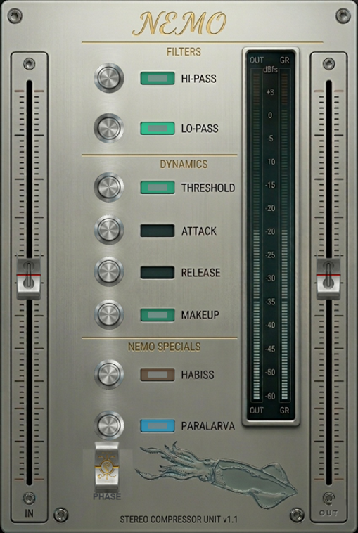

# NEMO — Stereo Compressor

Plugin audio **AU + VST3** per il mastering/mix bus, con skin fotorealistico in stile Waves.
Scritto in **C++ / [JUCE](https://juce.com) 8.0.8**, universal binary su macOS (Apple Silicon + Intel) e nativo su Linux.

<p align="center">
  
</p>

## Catena di processing

```
INPUT → [HI-PASS] → [LO-PASS] → [COMPRESSOR 4:1] → [HABISS sat] → [PARALARVA widener M/S] → OUTPUT
```

| Sezione | Controllo | Note |
|---|---|---|
| **IN / OUT** | Fader laterali | Guadagno di input e output (±24 dB) |
| **PHASE** | Switch | Inverte la polarità (L+R) |
| **FILTERS** | Hi-Pass / Lo-Pass | Filtri Butterworth 2° ordine |
| **DYNAMICS** | Threshold / Attack / Release / Makeup | Compressore peak-detector stereo-linked, ratio fisso 4:1 |
| **NEMO SPECIALS** | Habiss | Saturazione tape (waveshaper tanh) |
| **NEMO SPECIALS** | Paralarva | Stereo widener Mid/Side (0 = mono, 1 = invariato, 2 = max) |

I box accanto ai nomi si **accendono** quando lo stage è attivo: Threshold pulsa con la compressione, Habiss vira al rosso più satura, Paralarva diventa azzurra più allarghi. I valori numerici compaiono nel popup mentre trascini un knob.

> Nel DAW il plugin appare come **"Stereo Compressor"** (produttore **MyPlugins**). "NEMO" è il nome del modello/skin.

---

## Installazione da zero

Il plugin si compila dai sorgenti. **JUCE viene scaricato automaticamente** da CMake: non serve installarlo a mano.

### Requisiti comuni
- **Git**
- **CMake ≥ 3.22**
- Un compilatore C++17

---

## 🍎 macOS — Logic Pro (Audio Unit)

> Logic Pro carica **solo Audio Unit** (non VST3). Useremo il file `.component`.

### 1. Strumenti di build
```bash
# Command Line Tools di Xcode (compilatore)
xcode-select --install

# Homebrew (se non ce l'hai): https://brew.sh
# CMake
brew install cmake
```

### 2. Clona e compila
```bash
git clone https://github.com/<TUO_UTENTE>/NEMO-StereoCompressor.git
cd NEMO-StereoCompressor
cmake -B build -DCMAKE_BUILD_TYPE=Release
cmake --build build --config Release
```

### 3. Installa l'Audio Unit
La build copia già il plugin in `~/Library/Audio/Plug-Ins/Components/`.
Se vuoi farlo a mano:
```bash
cp -R "build/StereoCompressor_artefacts/Release/AU/Stereo Compressor.component" ~/Library/Audio/Plug-Ins/Components/
```

### 4. Togli la quarantena Gatekeeper (plugin non firmato)
```bash
xattr -dr com.apple.quarantine "$HOME/Library/Audio/Plug-Ins/Components/Stereo Compressor.component"
```

### 5. Verifica che l'AU sia valido
```bash
auval -v aufx Scmp Mypl
# deve stampare: AU VALIDATION SUCCEEDED.
```

### 6. Apri in Logic Pro
1. Avvia (o riavvia) **Logic Pro** → all'avvio scansiona i nuovi Audio Unit.
2. Su una traccia/bus **stereo**, slot **Audio FX** → **Audio Units → MyPlugins → Stereo Compressor**.
3. Se non compare: Logic Pro → *Impostazioni → Plug-in Manager* → seleziona il plugin → **Reset & Rescan Selection**.

---

## 🐧 Linux — Reaper (VST3)

> Su Linux si compila il **VST3** (l'Audio Unit esiste solo su macOS).

### 1. Dipendenze (Debian/Ubuntu)
```bash
sudo apt update
sudo apt install -y \
  build-essential cmake git \
  libasound2-dev libfreetype6-dev libfontconfig1-dev \
  libx11-dev libxext-dev libxinerama-dev libxrandr-dev \
  libxcursor-dev libxcomposite-dev libgl1-mesa-dev
```
*(Il browser web e cURL di JUCE sono disabilitati nel progetto, quindi non servono `libwebkit2gtk` né `libcurl`.)*

### 2. Clona e compila
```bash
git clone https://github.com/<TUO_UTENTE>/NEMO-StereoCompressor.git
cd NEMO-StereoCompressor
cmake -B build -DCMAKE_BUILD_TYPE=Release
cmake --build build --config Release
```

### 3. Installa il VST3
```bash
mkdir -p ~/.vst3
cp -r "build/StereoCompressor_artefacts/Release/VST3/Stereo Compressor.vst3" ~/.vst3/
```

### 4. Apri in Reaper
1. **Options → Preferences → Plug-ins → VST**.
2. In *VST plug-in paths* assicurati che ci sia `~/.vst3` (aggiungilo se manca).
3. Clicca **Re-scan**.
4. Su una traccia stereo: pulsante **FX → VST3: Stereo Compressor (MyPlugins)**.

---

## 🔄 Aggiornare il plugin

Quando esce una nuova versione su GitHub, ti basta scaricare le modifiche e ricompilare (JUCE resta in cache, la build è veloce).

### macOS (Logic Pro)
```bash
cd NEMO-StereoCompressor
git pull
cmake --build build --config Release
# la build ricopia da sola l'AU in ~/Library/Audio/Plug-Ins/Components/
# togli di nuovo la quarantena e rivalida:
xattr -dr com.apple.quarantine "$HOME/Library/Audio/Plug-Ins/Components/Stereo Compressor.component"
auval -v aufx Scmp Mypl
```
Poi **riavvia Logic Pro** (rilegge i plugin all'avvio). Se non vedi le modifiche: *Impostazioni → Plug-in Manager → Reset & Rescan Selection*.

### Linux (Reaper)
```bash
cd NEMO-StereoCompressor
git pull
cmake --build build --config Release
# ricopia il VST3 aggiornato:
cp -r "build/StereoCompressor_artefacts/Release/VST3/Stereo Compressor.vst3" ~/.vst3/
```
In Reaper di solito basta riaprire il progetto; se serve: *Preferences → Plug-ins → VST → Re-scan*.

> **Nota:** se cambi il `CMakeLists.txt` o la build dà errori dopo un aggiornamento grosso, rigenera la build da zero:
> ```bash
> rm -rf build
> cmake -B build -DCMAKE_BUILD_TYPE=Release
> cmake --build build --config Release
> ```

---

## Output della build

```
build/StereoCompressor_artefacts/Release/
├── AU/Stereo Compressor.component     # solo macOS
└── VST3/Stereo Compressor.vst3        # macOS + Linux
```

## Struttura del progetto

```
source/
├── PluginProcessor.{h,cpp}   # DSP (filtri, compressore, saturazione, widener)
├── PluginEditor.{h,cpp}      # UI / skin NEMO
├── LookAndFeel.{h,cpp}       # knob/fader disegnati con gli asset
└── assets/                   # immagini dello skin (sfondo, knob, fader, switch)
CMakeLists.txt                # build + download automatico di JUCE
```

## Crediti
Plugin in C++ con [JUCE](https://juce.com). Skin "NEMO" — riferimento visivo stile Waves; serigrafia ispirata a una paralarva di cefalopode.
